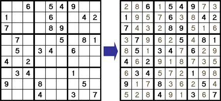

Curiosity Modeling Project for CS-1710 at Brown Univeristy. \
By: Rio Voss-Kernan and Angela Yeung
# --- Sudoku Solver --- 
## Project Objective
The aim of this project is to create a visual and formal sudoku representation/solver for a Sudoku board, where each cell can contain a number from 1 to 9, and ensure that the board follows the standard Sudoku rules. These rules include:
- Each number from 1 to 9 must appear exactly once in each row
- Each number must appear exactly once in each column
- Each number must appear exactly once in each of the nine 3x3 subgrids that divide the board. 

## Model Design and Visualization
### Design
The model was designed to both formalize and solve any Sudoku puzzle. From a high level, the predicates were designed to enforce the standard Sudoku rules, and there is also a mechanism to solve puzzles given the initial configuration. The overall board is represented as one object with a function mapping positions (row and column) to values, which makes it simpler to define constraints that apply to groups of cells or individual ones. Predicates were also defined to ensure that the board's structure and content are valid. 
The instance produced from the Sterling visualizer is based on the final run statement, which combines wellformed, SudokuRules, and solve[startBoard] to generate a solution. When interpreting an instance, the solution should be a fully populated 9x9 grid that follows the standard Sudoku rules. The initial values specified by startBoard are the fixed starting points for the puzzle and should be unchanged in the solution, and the remainder of the grid will be filled out in a way that correctly completes the puzzle. 

### Visualization
To visually distinguish the 3x3 subgrids (chunks) within the 9x9 grid, chunk outlines were added. These chunk outlines help players to more easily identify the 3x3 regions that must contain unique numbers from 1 to 9. To see the generated board, run the sudoku.frg file, switch to the script tab, then run svg visualizer mode. 

## Signature and Predicates
The model has a single sig, Board, with a values partial function mapping a row and column pair to the value at that position (cell), which captures the state of each cell on the board. This is the most intuitive representation as it mimics the actual structure of a puzzle and also simplifies the model, since we can now apply constraints directly to a centralized state. The wellformed predicate maintains a valid board layout, ensuring that all cells on the board are within a valid range (0-8 for rows and columns, 1-9 for values). Here, it also guarantees that any functions involving the board are based on a valid state. The FullBoard predicate checks whether the board is fully populated, that is, every cell within the board must have some value. It complements wellformed by ensuring that incomplete solutions are not considered valid.   SudokuRules enforces the core Sudoku rules (see Project Objective) across the entire board. The solve predicate finds a solution for a Sudoku puzzle that starts with a provided set of initial values (consisting of row index, column index, and cell value). The startBoard function, while not a predicate, defines a specific starting Sudoku configuration on master difficulty, providing initial values for specific cells and allowing the solve predicate to generate a solution.
	

## Testing
We developed a comprehensive test suite to confirm our model's correctness: it should follow Sudoku rules, and each instance should have the correct properties. There are four main areas: wellformedness, board completeness, rule enforcement, and solving functionality. The wellformedness tests check that cells contain values within the appropriate range and that they are within bounds. This verifies the basic requirement of any valid Sudoku puzzle. The next area tested is the completeness of the board, which confirms that every cell on the board is filled with a value and ensures that different states of the board are accurately captured by the model. The rule enforcement section essentially verifies that each row, column, and chunk (3x3 subgrid) should contain unique values. Finally, we evaluated the model's solver, focusing on whether it could accurately solve a puzzle based on a set of initial clues, as well as ensuring the initial numbers remain unchanged in the final puzzle. 
	
